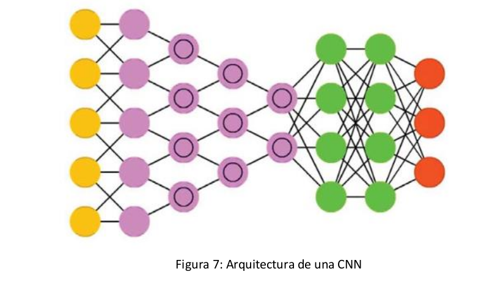

# Redes neuronales

## índice

1. [Definición](#definicion)
2. [Historia](#historia)
3. [¿Cómo se componen?](#como-se-componen)
4. [¿Cómo funcionan?](#como-funcionan)
5. [Tipos o clasificación](#tipos-o-clasificacion)
6. [Usos o aplicaciones](#usos-o-aplicaciones)
7. [Ventajas y desventajas](#ventajas-y-desventajas)
8. [Redes neuronales y programación lógica](#redes-neuronales-y-programacion-logica)
9. [Sistema Híbrido Neuro-Simbólico (SHNS)](#sistema-hibrido-neuro-simbolico-shns)
10. [Ejercicio de redes neurales resuelto en Prolog](#ejercicio-de-redes-neurales-resuelto-en-Prolog)
11. [Conclusión](#conclusion)
12. [Bibliografía](#bibliografia)


## Definición <a id="definicion"></a>

Las redes neuronales, también conocidas como redes neuronales artificiales (RNA) o redes neuronales simuladas (RNS), son un subconjunto de machine learning y constituyen el eje de los algoritmos de deep learning. Su nombre y estructura se inspiran en el cerebro humano, e imitan la forma en la que las neuronas biológicas se señalan entre sí.

Estas redes se basan en entrenar datos para aprender y mejorar su precisión con el tiempo, lo cual es un proceso de machine learning llamado aprendizaje profundo. Utilizan nodos o neuronas interconectadas en una estructura de capas que se parece al cerebro humano. Esta configuración crea un sistema adaptable que las computadoras utilizan para aprender de sus errores y mejorar continuamente.

Una vez que los algoritmos de aprendizaje en las redes neuronales se ajustan de manera precisa, se convierten en potentes herramientas que nos permiten clasificar y agrupar los datos a gran velocidad. Estas redes neuronales artificiales son capaces de resolver problemas complicados, como la realización de resúmenes de documentos o el reconocimiento de rostros, con mayor precisión.

Es importante mencionar que una de las redes neuronales más conocidas es el algoritmo de búsqueda de Google, que utiliza estos principios para ofrecer resultados precisos y relevantes a las consultas de los usuarios.

> Machine learning: o aprendizaje automático es una rama de la inteligencia artificial y la informática que se centra en el uso de datos y algoritmos para imitar la forma en que los humanos aprenden, mejorando gradualmente su precisión.

> Deep learning: es un subconjunto de machine learning, que es básicamente una red neuronal con tres o más capas. Estas redes neuronales intentan emular el comportamiento del cerebro humano y esto le permite "aprender" a partir de grandes cantidades de datos.

## Historia <a id="historia"></a>

1943: Warren S. McCulloch y Walter Pitts publicaron "A logical calculus of the ideas immanent in nervous activity”. En este estudio, se propuso un modelo de neurona artificial que comparaba las neuronas con un umbral binario a la lógica booleana.


1958: Frank Rosenblatt desarrolló el perceptrón y documentó su trabajo en "The Perceptron: A Probabilistic Model for Information Storage and Organization in the Brain”. El perceptrón introdujo ponderaciones en la ecuación y permitió a un ordenador aprender a distinguir patrones en los datos.


1974: Paul Werbos fue la primera persona en Estados Unidos en descubrir la aplicación de la retropropagación a las redes neuronales en su tesis doctoral.


1989: Yann LeCun publicó un estudio que ilustraba el uso de restricciones en la retropropagación y su integración en la arquitectura de redes neuronales para entrenar algoritmos. Esta investigación utilizó con éxito una red neuronal para reconocer los dígitos de código postal escritos a mano.


## ¿Cómo se componen? (Modelo General) <a id="como-se-componen"></a>

La estructura básica de una red neuronal consta de capas de neuronas interconectadas. La capa de entrada recibe los datos del mundo exterior y los envía a través de la red, mientras que la capa de salida produce el resultado final del procesamiento. Entre la capa de entrada y la capa de salida, puede haber una o más capas ocultas que procesan la información.

Cada neurona en la red neuronal está conectada a otras neuronas a través de conexiones que se asemejan a las sinapsis biológicas. Estas conexiones tienen pesos asociados que determinan la fuerza de la conexión. Durante el proceso de entrenamiento, estos pesos se ajustan mediante el aprendizaje para mejorar la precisión y el resultado de la salida de la red.


La red neuronal básica se compone de tres capas:

Capa de entrada: Aquí es donde la información del mundo exterior entra en la red. Los nodos de entrada procesan, analizan o clasifican los datos y los envían a la siguiente capa.

Capas ocultas: Estas capas toman su entrada de la capa de entrada o de otras capas ocultas. Pueden haber múltiples capas ocultas en una red neuronal artificial.

Capa de salida: Proporciona el resultado final del procesamiento de datos realizado por la red neuronal. Puede tener uno o varios nodos de salida.


## ¿Cómo funcionan? <a id="cómo-funcionan"></a>

La red neuronal funciona mediante una serie de procesos que involucran la propagación de datos a través de las neuronas y la utilización de funciones de activación para determinar las salidas.

Cada neurona en la red neuronal utiliza una función de activación para determinar su salida en función de la entrada que recibe. Estas funciones de activación pueden ser lineales, que multiplican la entrada por un peso y agregan un término de sesgo, o no lineales, que son más complejas y permiten a la red modelar relaciones no lineales en los datos.

Una vez que se determina una capa de entrada, se asignan ponderaciones a las conexiones entre las neuronas. Estas ponderaciones determinan la importancia de cada variable de entrada, donde las más grandes contribuyen más significativamente a la salida en comparación con otras entradas. Luego, todas las entradas se multiplican por sus respectivas ponderaciones y se suman. A continuación, la salida se pasa a través de la función de activación correspondiente, que determina la salida de la neurona.

Si la salida supera un determinado umbral, activa el nodo y pasa los datos a la siguiente capa de la red. Este proceso se repite en todas las capas de la red, donde la salida de una neurona se convierte en la entrada de la siguiente. Esto define la red neuronal como una red de propagación hacia delante, donde los datos fluyen en una sola dirección, desde la capa de entrada hasta la capa de salida.

En el caso de las redes neuronales profundas, que tienen múltiples capas ocultas, el proceso de propagación hacia delante se realiza a través de todas las capas ocultas hasta llegar a la capa de salida. Este proceso de propagación hacia delante permite que la red realice tareas de clasificación y predicción.

Además, para entrenar la red neuronal y ajustar sus parámetros para mejorar su rendimiento, se utiliza un proceso llamado retropropagación. En este proceso, se calcula y atribuye el error asociado a cada neurona en la capa de salida, y luego se propagan hacia atrás los errores a través de las capas ocultas hasta llegar a la capa de entrada. Esto permite ajustar y adecuar los parámetros del modelo en función del error cometido y mejorar el rendimiento de la red para tareas futuras.


## Tipos o clasificación <a id="tipos-o-clasificacion"></a>

Los diferentes tipos de redes neuronales y sus clasificaciones son los siguientes:

1. Redes Neuronales Feedforward:
La información fluye en una sola dirección, desde la capa de entrada hasta la capa de salida, sin ciclos o retroalimentación.
Se utilizan para tareas de clasificación y predicción.
Pueden ser entrenadas utilizando algoritmos de aprendizaje supervisado, como la retropropagación, para ajustar los pesos y mejorar la precisión.


2. Redes Neuronales Recurrentes:
Tienen conexiones retroalimentadas entre las neuronas, lo que les permite tener "memoria" de datos de entrada anteriores.
Son útiles para tareas que involucran secuencias de datos, como el procesamiento del lenguaje natural o la predicción de series temporales.
Para el entrenamiento, se utilizan algoritmos de aprendizaje como la retropropagación a través del tiempo.


3. Redes Neuronales Convolucionales (CNN):
Principalmente utilizadas para el procesamiento de imágenes y videos.
Organizan las neuronas en capas convolucionales, donde cada neurona está conectada solo a una región local de la capa anterior, lo que permite detectar características específicas en una imagen.
Aprovechan principios del álgebra lineal, como la multiplicación de matrices, para identificar patrones dentro de una imagen.



4. Clasificación en base a la estructura:
* Monocapa: Una única capa de neuronas sin conexiones entre ellas, adecuada para problemas sencillos.
Multicapa: Capa de entrada, capas ocultas y capa de salida. Conexiones entre capas, ampliamente utilizada.
* Convolucional: Similar a la multicapa, pero con conexiones locales en lugar de globales, ideal para el procesamiento de imágenes.
Concurrentes: Neuronas interconectadas de manera no estructurada, permitiendo la memoria y el procesamiento en iteraciones anteriores.

5. Clasificación en base al tipo de aprendizaje:

* Supervisado: Se proporcionan secuencias de entrenamiento con resultados conocidos para ajustar los pesos de la red y minimizar el error.
Corrección de error: Se utilizan algoritmos de cálculo del error como backpropagation para ajustar los pesos.

* Estocástico: Cambios aleatorios en los pesos para obtener mejores resultados.
No supervisado: Algoritmos que buscan patrones y características en los datos de entrada para ajustar los pesos.

* Refuerzo: Similar al aprendizaje supervisado, pero sin resultados conocidos, solo se indica si el resultado es aceptable o no para ajustar los pesos.
En resumen, los distintos tipos de redes neuronales se adaptan a diferentes tareas y conjuntos de datos, y el tipo de aprendizaje utilizado influye en la forma en que se ajustan los pesos de la red durante el entrenamiento.


## Usos o aplicaciones ¿Cómo se usan y por qué? <a id="usos-o-aplicaciones"></a>

Las redes neuronales tienen una amplia variedad de aplicaciones y usos debido a su capacidad para reconocer patrones complejos en grandes conjuntos de datos. Algunas de las principales aplicaciones son las siguientes:

1. Reconocimiento de Patrones:
Identificar patrones en ondas sonoras y convertirlas en texto.
Reconocer características específicas en imágenes, como formas y colores, para clasificarlas en diferentes categorías.

2. Procesamiento de Lenguaje Natural (NLP):
Traducción automática de idiomas al analizar patrones en el lenguaje.
Generación de texto coherente y relevante para escribir historias o artículos.
Analizar el lenguaje para entender las intenciones del usuario y proporcionar respuestas adecuadas.

3. Visión por Computadora:
Identificación de objetos en imágenes y videos, útil en detección de objetos en tiempo real y seguimiento de objetos.
Clasificación de imágenes y proporcionar información sobre ellas.

4. Predicción y Toma de Decisiones:
Análisis de datos para predecir preferencias de compra en el comercio electrónico.
Aplicación en otras áreas para la predicción y toma de decisiones basadas en patrones reconocidos.

5. Visión Artificial:
Reconocimiento visual en vehículos autónomos para identificar señales de tráfico y otros usuarios del camino.
Moderación de contenido para eliminar automáticamente contenidos inseguros o inapropiados de imágenes y videos.
Reconocimiento facial para identificar rostros y atributos.

6. Reconocimiento de Voz:
Análisis de habla humana para reconocer patrones de habla, tonos, idiomas y acentos.
Utilizado en asistentes virtuales y software de transcripción automática.

7. Motores de Recomendaciones:
Seguimiento de la actividad del usuario para ofrecer recomendaciones personalizadas.
Descubrir productos o servicios nuevos que puedan interesar a un usuario específico.


## Ventajas y desventajas <a id="ventajas-y-desventajas"></a>

Las redes neuronales ofrecen varias ventajas significativas, pero también tienen algunas desventajas que deben tenerse en cuenta. A continuación, se presentan tanto las ventajas como las desventajas de las redes neuronales:

### Ventajas:
* Aprendizaje Adaptativo: Capacidad de aprender tareas a través del entrenamiento y la experiencia inicial, lo que les permite mejorar su rendimiento con el tiempo.
* Autoorganización: Las redes neuronales pueden crear su propia representación interna de la información a través del aprendizaje, lo que facilita la comprensión y clasificación de datos complejos.
* Generalización: Pueden responder adecuadamente a datos o situaciones que no han sido presentadas durante el entrenamiento, lo que las hace útiles para tareas de predicción y clasificación en entornos cambiantes.
* Tolerancia a fallos: A pesar de la destrucción parcial de la red, pueden retener algunas capacidades y aprender a reconocer patrones incluso en datos ruidosos, distorsionados o incompletos.
* Operación en Tiempo Real: Las redes neuronales pueden implementarse en paralelo, lo que les permite operar en tiempo real y realizar cálculos más rápidos en tareas específicas.
* Fácil Inserción en Tecnología Existente: Se pueden obtener chips especializados para redes neuronales, lo que facilita su integración modular en sistemas existentes, mejorando su capacidad para tareas específicas.

### Desventajas:
* Necesidad de Grandes Cantidades de Datos: Requieren grandes conjuntos de datos para entrenar con precisión, lo que puede ser costoso o limitar su uso en entornos con datos escasos.
* Dificultad en la interpretación: Las redes neuronales son difíciles de interpretar, lo que dificulta comprender cómo y por qué llegan a ciertas predicciones, lo que puede plantear problemas en aplicaciones críticas.
* Sobreentrenamiento: Debido a su alta capacidad de aprendizaje, las redes neuronales pueden sobre-ajustarse a los datos de entrenamiento y tener un rendimiento deficiente en datos nuevos.
* Función de Pérdida No Convexa: Los perceptrones multicapa pueden tener múltiples mínimos locales en su función de pérdida, lo que hace que los resultados puedan variar según los valores iniciales de los pesos.
* Ajuste de Hiper-parámetros: Es necesario ajustar varios hiper-parámetros, como el número de capas ocultas y funciones de activación, lo que puede requerir un esfuerzo significativo para optimizar su rendimiento.
* Sensibilidad a la Escala de Datos: Las redes neuronales son sensibles a la escala de los datos, por lo que se requiere una transformación adecuada de los datos para obtener un rendimiento óptimo.


| Ventajas | Desventajas | 
|-----|------------------| 
| Aprendizaje Adaptativo | Necesidad de Grandes Cantidades de Datos | 
| Autoorganización | Dificultad en la Interpretación | 
| Generalización | Sobreentrenamiento | 
| Tolerancia a Fallos | Función de Pérdida No Convexa | 
| Operación en Tiempo Real | Ajuste de Hiperparámetros | 
| Fácil Inserción en Tecnología Existente | Sensibilidad a la Escala de Datos |


## Redes neuronales y programación lógica <a id="redes-neuronales-y-programacion-logica"></a>

La relación entre redes neuronales y programación lógica se encuentra en el campo de la Inteligencia Artificial y el aprendizaje automático, donde ambas abordan problemas de manera diferente pero pueden combinarse en ciertos contextos.

### Diferencias entre redes neuronales y programación lógica

Las redes neuronales son un enfoque de aprendizaje automático basado en la estructura de redes inspiradas en el cerebro humano. Se centran en aprender a partir de ejemplos y ajustar sus parámetros para hacer predicciones o clasificar datos sin necesidad de reglas explícitas.
La programación lógica, por otro lado, es un paradigma de programación en el que se expresan relaciones lógicas entre hechos y reglas para inferir conclusiones. Se basa en la lógica formal y se utiliza para resolver problemas a través de la deducción lógica.

### Integración de redes neuronales en programación lógica

En algunos casos, es posible combinar redes neuronales con la programación lógica para aprovechar las fortalezas de ambos enfoques. Por ejemplo, se pueden utilizar redes neuronales para aprender reglas o patrones complejos a partir de datos, y luego utilizar esas reglas en una programación lógica para razonar y tomar decisiones.

Representación del conocimiento:
* En programación lógica, el conocimiento se representa mediante reglas lógicas, cláusulas, hechos y relaciones. La inferencia se realiza mediante un motor de inferencia lógica.
* En redes neuronales, el conocimiento se aprende a partir de datos mediante la modificación de los pesos y las conexiones entre las neuronas.

Razonamiento probabilístico:
* Las redes neuronales, especialmente cuando se utilizan para clasificación, proporcionan una salida determinista (una etiqueta de clase específica).
* La programación lógica puede emplear razonamiento probabilístico para inferir conclusiones con incertidumbre y lidiar con información incompleta o ambigua.

Lógica difusa y redes neuronales:
* La lógica difusa se utiliza para lidiar con la imprecisión y la incertidumbre en los datos o en los resultados de las redes neuronales. Puede combinarse con redes neuronales para mejorar su capacidad para manejar información difusa y dar lugar a sistemas más robustos.


## Sistema Híbrido Neuro-Simbólico (SHNS) <a id="sistema-hibrido-neuro-simbolico-shns"></a>


Existe una técnica híbrida llamada "Neuro-Symbolic Integration" (Integración Neuro-Simbólica) que combina elementos de redes neuronales y programación lógica para resolver problemas de inteligencia artificial de manera más efectiva. Esta técnica busca aprovechar las ventajas de ambos paradigmas y superar algunas de sus limitaciones individuales.
Un ejemplo de esto es el sistema "Neural-Symbolic Learning and Reasoning" (Aprendizaje y Razonamiento Neural-Simbólico, abreviado como NSLR). Que combina el deep-learning de redes neuronales con el razonamiento lógico y simbólico para abordar problemas de procesamiento del lenguaje natural, en particular, la resolución de preguntas sobre texto.

En NSLR, el proceso de integración generalmente se desarrolla en varias etapas:

* Extracción de características: Una red neuronal profunda se entrena para extraer características semánticas y relevantes del texto de entrada. Por ejemplo, puede ser un modelo de procesamiento del lenguaje natural (NLP) que convierte oraciones en vectores de palabras o embeddings.

* Representación simbólica: Luego, las salidas de la red neuronal, que son representaciones numéricas, se traducen en un formato simbólico o lógico que permita razonar sobre ellas. Esto podría implicar transformar las representaciones numéricas en términos lógicos o predicados que reflejen la estructura semántica del texto.

* Razonamiento lógico: Se utiliza un motor de inferencia lógica para procesar las representaciones simbólicas y responder preguntas sobre el texto. El razonador lógico puede ser un sistema de lógica de primer orden (FOL) que utiliza reglas lógicas y hechos para deducir respuestas.

* Retroalimentación: El proceso puede incluir una retroalimentación desde el razonador lógico hacia la red neuronal, donde se utilizan las respuestas obtenidas del razonamiento para refinar aún más la red neuronal en etapas de entrenamiento posteriores.

Este enfoque híbrido permite superar algunas de las limitaciones que tienen los enfoques puramente simbólicos o puramente basados en redes neuronales. por ejemplo: la dificultad de las redes neuronales artificiales (RNA) para explicar los resultados obtenidos y por otro lado la dificultad de una representación simbólica para generalizar el conocimiento o dificultades en el procesamiento de grandes cantidades de datos no estructurados, trajo como consecuencia que ambas técnicas se integrarán y se complementaran en un solo enfoque llamado Sistema Híbrido Neuro-Simbólico (SHNS). Entonces, surgieron trabajos relacionados con la inserción, el refinamiento y la extracción de conocimientos.

## Ejercicio de redes neurales resuelto en Prolog <a id="ejercicio-de-redes-neurales-resuelto-en-Prolog"></a>

El objetivo de este ejercicio es implementar una red neuronal que pueda clasificar si un animal es un mamífero o no, en función de dos características: 

Si tiene pelo y si produce leche.

### Implementación en Prolog:

```
% Definición de la red neuronal:
% Pesos sinápticos
% Sesgo
neural_network(X1, X2, Y) :-
    w1(W1),  
    w2(W2),
    b(B),    

% Cálculo de la suma ponderada
weighted_sum(X1, X2, W1, W2, B, Z), 

% Función de activación
activation_function(Z, Y). 

% Pesos sinápticos y sesgo predefinidos
w1(0.5).
w2(0.5).
b(-0.7).

% Función para calcular la suma ponderada:
weighted_sum(X1, X2, W1, W2, B, Z) :-
    Z is X1 * W1 + X2 * W2 + B.

% Función de activación (umbral):
activation_function(Z, 1) :- Z >= 0.
activation_function(Z, 0) :- Z < 0.

% Ejemplos de animales:
animal(gato, 1, 1).    % Tiene pelo y produce leche
animal(tigre, 1, 0).   % Tiene pelo, pero no produce leche
animal(ballena, 0, 1). % No tiene pelo, pero produce leche
animal(cocodrilo, 0, 0). % No tiene pelo ni produce leche

% Predicado para clasificar animales:
classify_animal(Animal) :-
    animal(Animal, X1, X2), % Obtener las características del animal
    neural_network(X1, X2, Y), % Clasificar utilizando la red neuronal
    Y = 1, % Y = 1 representa que es un mamífero
    format('~w es un mamífero.~n', [Animal]).

classify_animal(Animal) :-
    animal(Animal, X1, X2),
    neural_network(X1, X2, Y),
    Y = 0,
    format('~w no es un mamífero.~n', [Animal]).
```

Para utilizar la red neuronal, puedes llamar al predicado classify_animal/1 pasando el nombre del animal como argumento. 

### Test, en prolog consola:

```
classify_animal(gato).
gato es un mamífero.

true.

classify_animal(ballena).
ballena es un mamífero.

true.

classify_animal(tigre).
tigre no es un mamífero.

true.

classify_animal(cocodrilo).
cocodrilo no es un mamífero.

true.
```

Este código en Prolog implementa una red neuronal simple para clasificar animales como mamíferos o no mamíferos en función de dos características: 

Si es mamífero o no lo es. 

### Detalles de la implementación:

* Definición de la red neuronal:
La red neuronal se define mediante el predicado neural_network/3. Toma tres argumentos: X1, X2 (las características del animal) y Y (la salida de la red neuronal, que representa si el animal es un mamífero o no).

* Pesos sinápticos y sesgo:
Los pesos sinápticos (w1 y w2) y el sesgo (b) están predefinidos en el código. Estos valores determinan la importancia relativa de las características en la clasificación.

* Cálculo de la suma ponderada:
El predicado weighted_sum/6 se encarga de calcular la suma ponderada de las características (X1 y X2) utilizando los pesos sinápticos (W1 y W2) y el sesgo (B). La suma ponderada se almacena en Z.

* Función de activación:
La función de activación determina el valor de salida (Y) de la red neuronal en función de la suma ponderada (Z). Si Z es mayor o igual a cero, Y se establece en 1, lo que representa que el animal es un mamífero. Si Z es menor que cero, Y se establece en 0, lo que representa que el animal no es un mamífero.

* Ejemplos de animales:
El código proporciona ejemplos de animales junto con sus características. Cada animal se define mediante el predicado animal/3, que toma el nombre del animal, X1 y X2 como argumentos.

* Predicado para clasificar animales:
El predicado classify_animal/1 se utiliza para clasificar un animal dado. Toma el nombre del animal como argumento, obtiene sus características utilizando el predicado animal/3 y luego utiliza la red neuronal (neural_network/3) para determinar si el animal es un mamífero o no. Dependiendo del valor de Y, se muestra un mensaje indicando si el animal es un mamífero o no.

## Conclusión <a id="conclusion"></a>

En este análisis, hemos explorado conceptos relacionados con las redes neuronales y el paradigma de programación lógica. Comenzamos definiendo qué son las redes neuronales, destacando su estructura inspirada en el funcionamiento del cerebro humano y su capacidad para aprender a través de la experiencia.

Obtuvimos una visión general sobre las redes neuronales, utilizadas ampliamente en campos como el reconocimiento de patrones, procesamiento de lenguaje natural, visión por computadora, predicción y toma de decisiones, así como en aplicaciones específicas como visión artificial y motores de recomendaciones.

Se presentó el concepto de Integración Neuro-Simbólica, que combina técnicas de la inteligencia artificial simbólica y conexionista para aprovechar lo mejor de ambos enfoques.

Tambien analizamos sus ventajas y desventajas, así como algunas aplicaciones relacionadas con el Procesamiento del Lenguaje Natural y las implementaciones en Prolog. Cada uno de estos temas ofrece oportunidades interesantes y desafiantes en el campo de la inteligencia artificial y la computación cognitiva.


## Bibliografía <a id="bibliografia"></a>

##### https://www.ibm.com/es-es/topics/neural-networks 

##### https://aws.amazon.com/es/what-is/neural-network/

##### https://openwebinars.net/blog/que-son-las-redes-neuronales-y-sus-aplicaciones/ 

##### https://www.unir.net/ingenieria/revista/redes-neuronales-artificiales/ 

##### https://en.wikipedia.org/wiki/Neuro-symbolic_AI

##### https://research.ibm.com/topics/neuro-symbolic-ai

##### https://bibliotecadigital.univalle.edu.co/bitstream/handle/10893/1452/Diseno%20de%20sitemas%20hibridos%20neuro.pdf


